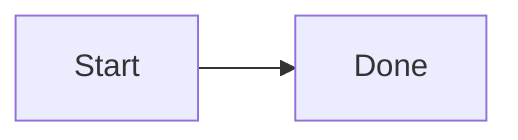

# Docsprout

[![npm package][npm-img]][npm-url]
[![Downloads][downloads-img]][downloads-url]
[![Issues][issues-img]][issues-url]
![ES Version][es-version]
![Node Version][node-version]

[npm-img]: https://img.shields.io/npm/v/docsprout/latest
[npm-url]: https://www.npmjs.com/package/docsprout
[downloads-img]: https://img.shields.io/npm/dt/docsprout
[downloads-url]: https://www.npmtrends.com/docsprout
[issues-img]: https://img.shields.io/github/issues/moazzamgodil/docsprout
[issues-url]: https://github.com/moazzamgodil/docsprout/issues
[es-version]: https://img.shields.io/badge/ES-2020-yellow
[node-version]: https://img.shields.io/badge/node-20.x-green

Docsprout is a CLI that adds a documentation site and admin editor to an existing project using Markdown files.

After setup, your docs are available at:
- `/docs` (public docs)
- `/docs-admin` (admin editor)

## Who This Is For

Use Docsprout if you want to:
- keep docs in Markdown inside your repo
- generate navigation/search automatically
- maintain draft vs published content

## Requirements

- Node.js 18+
- npm 9+
- An existing JavaScript/TypeScript project

## Install

```bash
npm install -D docsprout
```

You can also run commands directly with `npx` without adding scripts.

## Quick Start

From your project root:

```bash
npx docsprout init
npx docsprout dev
```

Then open:
- `http://localhost:3000/docs`
- `http://localhost:3000/docs-admin`

## Recommended npm Scripts

```json
{
  "scripts": {
    "docs:init": "docsprout init",
    "docs:upgrade": "docsprout upgrade",
    "docs:scan": "docsprout scan",
    "docs:dev": "docsprout dev",
    "docs:build": "docsprout build",
    "docs:publish": "docsprout publish"
  }
}
```

## CLI Commands

### `docsprout init`
Initializes Docsprout in your repository.

Creates/updates the `docsprout/` workspace used by the docs runtime.

### `docsprout upgrade`
Upgrades generated docs runtime files to the latest scaffold template.

### `docsprout scan`
Rescans Markdown sources and regenerates docs data (pages, sidebar, search).

### `docsprout dev`
Runs docs + admin in development mode with file watching.

### `docsprout build`
Builds production assets.

### `docsprout publish`
Builds a production-ready output that excludes draft content.

Note: `docsprout publish` is a content build command, not `npm publish`.

## Markdown Discovery

By default, Docsprout scans configured content roots for:
- `README.md`
- `*.md`
- `*.mdx`

Default ignore patterns include:
- `node_modules`
- `dist`
- `build`
- `coverage`
- `.next`
- hidden folders

## Configuration

Edit `docsprout/config.json`:

```json
{
  "projectName": "My Project",
  "contentRoots": [".", "packages/*", "apps/*"],
  "ignore": [
    "**/node_modules/**",
    "**/dist/**",
    "**/build/**",
    "**/coverage/**",
    "**/.next/**",
    "**/.*/**"
  ],
  "theme": "default",
  "basePath": "/docs",
  "adminPath": "/docs-admin",
  "outputDir": "docsprout",
  "includeDraftsInDev": true
}
```

Field notes:
- `contentRoots`: where Markdown is discovered
- `basePath`: URL path for public docs
- `adminPath`: URL path for admin editor
- `includeDraftsInDev`: include draft pages during local development

## Draft vs Published Content

Use frontmatter:

```md
---
title: API Overview
status: draft
order: 3
tags: [api, backend]
---
```

Rules:
- `status: draft` appears in admin/dev workflows
- `status: published` is included in production/publish output

## Diagram Support

Docs and preview support Mermaid and common diagram syntaxes via fenced code blocks.

Example:

<pre>

</pre>

## Monorepo Support

Docsprout works with:
- npm workspaces
- Turborepo
- Nx

Run commands from your repository root.

## Troubleshooting

### Docs changes not appearing

Run:

```bash
npx docsprout scan
```

### Page missing in production output

Confirm frontmatter:
- `status` must be `published`

### Runtime scaffold is outdated

Run:

```bash
npx docsprout upgrade
```

## License

MIT